# Active Context: SeekerAug

> **Note:** All UI/UX implementation must follow the canonical VS Code-inspired design rules in [systemPatterns.md](systemPatterns.md), section "VS Code-Inspired UI/UX Architecture & Design Rules (2025-04-21)".

## Current Work Focus

- Robust, project-isolated dataset management with a professional, workstation-grade UI.
- End-to-end workflow: project creation, raw dataset import (including TIFFs), dataset processing (JPG conversion, metadata extraction), and dataset history/audit trail.
- Preparing for annotation, augmentation, and training integration.

## Recent Changes

- Projects are now fully isolated: each has its own directory, database, and raw/processed datasets.
- Project management (list, create, delete) is now fully persistent and handled via the Flask backend API; no localStorage/in-memory logic remains.
- Welcome Page and Project Dashboard are fully integrated with backend persistence and provide a professional, VS Code-inspired experience.
- Theming system is now VS Code-style: JSON theme files, dynamic loader, and CSS variables. All UI components use these variables for styling.
- Raw dataset workflow: supports import of images (jpg, png, tif, etc.) with original filenames preserved for user clarity.
- Refined dataset workflow: all raw images can be processed to high-quality JPGs, with metadata (dimensions, format, TIFF tags, etc.) extracted and stored.
- Dataset history: all additions/removals to the raw dataset are logged in a per-project audit trail, viewable in the UI.
- UI/UX: 
  - Main application window structure scaffolded: persistent explorer pane, centered command bar with command palette button, tabbed workspace, context panel, and status bar.
  - Explorer Pane implemented: shows dataset types (Raw, Refined, Annotated, Augmented) with color-coded badges and action buttons (open in file explorer, export).
  - Command Palette button is centered in the top bar; modal overlay is centered on screen.
  - "New Project" modal and logic restored; users can create new projects from the welcome screen.
  - Workspace now displays a dashboard with the project name and welcome message after opening a project.
  - Command Palette closes on command.
- Immediate import for empty projects; staged import for non-empty projects.
- Backend endpoints for all major operations, with strict project scoping.
- **Tab System Foundation:** Implemented core state management (`openTabs`, `activeTabId`) and handlers (`handleOpenTab`, `handleSelectTab`, `handleCloseTab`) in `App.jsx`. Workspace now renders a `TabBar` and content based on the active tab. `handleOpenProject` automatically opens a dashboard tab. `handleCloseProject` clears tabs.
- **Resizable Panes:** Implemented basic resizable sidebar and context panel using drag handles. Panes minimize if dragged below a threshold and can be restored by clicking the minimized icon. Resizers are hidden when panes are minimized.
- **Bugfixes:**
  - Added missing import json to backend modules, resolving backend crashes on image import/delete.
  - Added ErrorBoundary to the frontend, so React errors now show a clear message instead of a blank screen.
  - Added useState for processedMetadata in App.jsx, fixing ReferenceError and preventing frontend crash.
  - All processed dataset summary and grid views now have robust error handling and null checks.
  - Fixed crash on closing last tab by adjusting `Workspace` rendering logic.
  - Fixed crash on opening project by ensuring `ProjectDashboard` receives `images` prop safely (fetching images in `handleOpenProject` and passing `images || []`).
  - Improved tab close icon visibility using `var(--foreground-primary)`.
  - **Partially Fixed Pane Styling:**
    - Moved theme loading to `index.jsx` to ensure variables are available before initial render.
    - Replaced collapse icon `button` elements with `span` elements.
    - Used CSS classes defined in `index.html` (`.sidebar-header-text`, `.sidebar-collapse-icon`) applied via `className` in `App.jsx`. Sidebar header/icon colors are now correct.
    - **Persistent Issue:** Context Panel placeholder text (`[Context Panel Placeholder]`) remains black despite multiple attempts to apply `var(--foreground-secondary)`:
        - Applying CSS class `.context-placeholder-text` (defined in `index.html`).
        - Increasing CSS specificity (`.context-panel .context-placeholder-text` in `index.html`).
        - Applying inline style `color: var(--foreground-secondary)` directly to the element in `App.jsx`.
        - Applying inline style `color: var(--foreground-secondary) !important` directly to the element.
        - Applying hardcoded inline style `color: "#9D9D9D !important"` directly to the element.
        - DevTools inspection confirms the styles are applied but the computed color remains black (`rgb(0, 0, 0)`). The root cause is unknown and likely involves a very specific override (potentially browser default with high specificity or JS interference). This issue is shelved for now.
  - **Fixed Raw Image Import:** Confirmed `projectApi.js` correctly uses `FormData` and expects `File` objects. Reverted incorrect change in `App.jsx` that was sending file paths instead. Image import is now functional.
  - **Fixed Context Panel Text Color:** Explicitly set `color: var(--foreground-primary)` on the `.context-panel` root to ensure all children inherit the correct theme color variable, resolving the persistent black text issue.

## Styling Analysis & Next Steps

- **Analysis:** The Context Panel placeholder text color issue is highly persistent and resistant to standard CSS specificity increases, inline styles, and even `!important`. The root cause remains unidentified after extensive troubleshooting.
- **Next Steps (Styling):** The Context Panel placeholder text color issue is **shelved**. No further attempts will be made at this time. Focus will shift to other UI/UX tasks.
- **Next Steps (General):**
    - Address remaining image import issues (shelved for now).
    - **Refine Tab System:**
      - Implement rendering logic for different tab types (Grid view, Image viewer, etc.) within the `Workspace`.
      - Add functionality to open specific tabs (e.g., image viewer) from interactions (e.g., clicking an image in the grid).
    - **Refine Resizable Panes:**
      - Persist pane widths and minimized state to local storage.
    - **Implement Explorer Pane Content:**
      - Display actual dataset tree (Raw, Refined, etc.) with badges and actions.
      - Integrate explorer actions to open relevant tabs (e.g., clicking "Raw Dataset" opens a grid view tab).
    - **Implement Context Panel Content:**
      - Add tabs/sections within the context panel (Metadata, History, etc.).
      - Make content dynamic based on the active workspace tab.
    - Implement VS Code-style tab system features:
      - Tab types:
        - Grid view (dataset overview) - *Partially addressed by dashboard*
        - Image viewer (quick, lightweight) - *Next*
        - Image annotator (bounding box, polygon, etc.)
        - Dataset manipulator (advanced dataset operations, grouping, filtering, reordering)
        - Class editor (explore/edit classes, ontological hierarchy, search, export, metadata/cropped previews)
        - [Future] More tab types as needed (e.g., training, metrics, augmentation pipeline)
      - Blank background when no tabs are open; tabs can be opened/closed.
      - Clicking an image in the grid opens a viewer tab (default), with option to switch to annotation/augmentation.
      - One image per tab (for now); future extensibility for multi-image tabs.
      - Tabs can go full screen, optimized for ultrawide screens.
      - Standard keyboard shortcuts (e.g., Ctrl+Tab to switch tabs, but not Ctrl+W to close).
      - Switching datasets while tabs are open is not allowed; prompt user to close tabs first.
      - Explorer is focused on information and quick actions; main work is done in the workspace/tabs.
      - Advanced dataset/class manipulation (grouping, ontological hierarchy, export) is available in dedicated tabs, not the explorer.
    - Implement auto-annotation feature:
      - User annotates a small set of images (e.g., 10-20).
      - System trains a quick PyTorch model (with augmentation) on the GPU.
      - Model is used to auto-annotate remaining images (bounding boxes, polygons, pose [future]).
      - User can review, correct, and accept/reject auto-annotations.
    - Explorer pane always shows all datasets (raw, refined, augmented) and allows navigation, but switching datasets while tabs are open is not allowed. Attempting to switch prompts the user to close tabs first.
      - Explorer can be resized or minimized (0:100, 30:70, 50:50 splits).
      - Advanced dataset manipulation (e.g., grouping by time/place, reordering) should be available in a dedicated tab, not the explorer itself.
      - Explorer is focused on information and quick actions; main work is done in the workspace/tabs.
    - Implement annotation workflow: annotation UI, backend endpoints, and storage (COCO, YOLO, etc.).
    - Develop augmentation pipeline: UI for building augmentation steps, backend for applying them, and visualization of augmented data.
    - Integrate model training: training config UI, backend job management, and training dashboard.
    - Advanced metadata: support for geospatial/scale info, especially for scientific/aerial imagery.
    - Dataset/annotation versioning and diff tools.
    - Continue to refine the UI for a dense, information-rich, and professional experience.
    - Plan for future collaborative features (multi-client, P2P, real-time sync).

- **Refine Tab System:**
  - Implement rendering logic for different tab types (Grid view, Image viewer, etc.) within the `Workspace`.
  - Add functionality to open specific tabs (e.g., image viewer) from interactions (e.g., clicking an image in the grid).
- **Refine Resizable Panes:**
  - Persist pane widths and minimized state to local storage.
- **Implement Explorer Pane Content:**
  - Display actual dataset tree (Raw, Refined, etc.) with badges and actions.
  - Integrate explorer actions to open relevant tabs (e.g., clicking "Raw Dataset" opens a grid view tab).
- **Implement Context Panel Content:**
  - Add tabs/sections within the context panel (Metadata, History, etc.).
  - Make content dynamic based on the active workspace tab.
- Implement VS Code-style tab system features:
  - Tab types:
    - Grid view (dataset overview) - *Partially addressed by dashboard*
    - Image viewer (quick, lightweight) - *Next*
    - Image annotator (bounding box, polygon, etc.)
    - Dataset manipulator (advanced dataset operations, grouping, filtering, reordering)
    - Class editor (explore/edit classes, ontological hierarchy, search, export, metadata/cropped previews)
    - [Future] More tab types as needed (e.g., training, metrics, augmentation pipeline)
  - Blank background when no tabs are open; tabs can be opened/closed.
  - Clicking an image in the grid opens a viewer tab (default), with option to switch to annotation/augmentation.
  - One image per tab (for now); future extensibility for multi-image tabs.
  - Tabs can go full screen, optimized for ultrawide screens.
  - Standard keyboard shortcuts (e.g., Ctrl+Tab to switch tabs, but not Ctrl+W to close).
  - Switching datasets while tabs are open is not allowed; prompt user to close tabs first.
  - Explorer is focused on information and quick actions; main work is done in the workspace/tabs.
  - Advanced dataset/class manipulation (grouping, ontological hierarchy, export) is available in dedicated tabs, not the explorer.
- Implement auto-annotation feature:
  - User annotates a small set of images (e.g., 10-20).
  - System trains a quick PyTorch model (with augmentation) on the GPU.
  - Model is used to auto-annotate remaining images (bounding boxes, polygons, pose [future]).
  - User can review, correct, and accept/reject auto-annotations.
- Explorer pane always shows all datasets (raw, refined, augmented) and allows navigation, but switching datasets while tabs are open is not allowed. Attempting to switch prompts the user to close tabs first.
  - Explorer can be resized or minimized (0:100, 30:70, 50:50 splits).
  - Advanced dataset manipulation (e.g., grouping by time/place, reordering) should be available in a dedicated tab, not the explorer itself.
  - Explorer is focused on information and quick actions; main work is done in the workspace/tabs.
- Implement annotation workflow: annotation UI, backend endpoints, and storage (COCO, YOLO, etc.).
- Develop augmentation pipeline: UI for building augmentation steps, backend for applying them, and visualization of augmented data.
- Integrate model training: training config UI, backend job management, and training dashboard.
- Advanced metadata: support for geospatial/scale info, especially for scientific/aerial imagery.
- Dataset/annotation versioning and diff tools.
- Continue to refine the UI for a dense, information-rich, and professional experience.
- Plan for future collaborative features (multi-client, P2P, real-time sync).

### Additional Planned UI/UX Features (from Design Language)

- Right context panel for properties, metadata, and context-sensitive tools (toggleable, changes with active tab).
- Status bar at the bottom for project info, operation status, notifications, quick settings, and hardware status.
- Command bar at the top for global actions and quick navigation (Ctrl+P palette).
- Usage marking system for images/annotations (used/unused, batch operations, inheritance rules, usage management UI).
- Lineage visualization: interactive graph/timeline of dataset and annotation relationships, with branching and filtering.
- Annotation history: timeline of changes, revert/compare, audit trail.
- Augmentation pipeline builder: drag-and-drop steps, parameter adjustment, save/load pipelines, real-time preview.
- Batch operations: copy annotations, multi-select, bulk editing, batch verification.
- Review/approval workflows: comment on annotations, mark for review, approval, quality metrics.
- Workspace customization: resizable panels, snap-to guides, layout presets, theme and shortcut customization.
- Keyboard shortcuts for all major actions (VS Code-inspired).
- Export enhancements: preview, format selection, progress indicators, export selected items, support for multiple annotation/model formats.

## Active Decisions & Considerations

- All dataset operations are strictly project-scoped; no cross-project data leakage.
- Raw and refined datasets are clearly separated, with full metadata and audit trails.
- The UI is designed for ultrawide, high-resolution workstation displays, with a focus on productivity and clarity.
- All implementation and documentation are kept in sync via the Memory Bank.
- Linux (Debian/Ubuntu) is the primary target, with local-only operation and no cloud dependencies.

---

## UI/UX Scaffold & Feature Roadmap (2025-04-21)

**Authoritative scaffold and feature roadmap for SeekerAug UI/UX. This section guides incremental implementation and ensures all features are integrated and maintainable.**

### High-Level UI/UX Scaffold

```mermaid
flowchart TD
    A[Main Window]
    A --> B[Explorer Pane]
    A --> C[Command Bar]
    A --> D[Tabbed Workspace]
    A --> E[Context Panel]
    A --> F[Status Bar]

    D --> D1[Tab: Grid View]
    D --> D2[Tab: Image Viewer]
    D --> D3[Tab: Annotation]
    D --> D4[Tab: Augmentation]
    D --> D5[Tab: Class Editor]
    D --> D6[Tab: Project Dashboard]
    D --> D7[Tab: Version/Lineage]

    B --> B1[Dataset List]
    B --> B2[Badges/Status]
    B --> B3[Actions: Open, Export, etc.]
    B --> B4[Integration: Open in Tab]

    E --> E1[Context-Sensitive Tools]
    E --> E2[Metadata]
    E --> E3[Toggle/Collapse]

    F --> F1[Project Info]
    F --> F2[Operation Status]
    F --> F3[Notifications]
    F --> F4[GPU Status]
    F --> F5[Quick Settings]

    C --> C1[Global Actions]
    C --> C2[Command Palette]
    C --> C3[Navigation: Forward/Back]
    C --> C4[Keyboard Shortcuts]

    D --> G[Tab State/History]
    G --> G1[Browser Navigation]
    G --> G2[State Restoration]
```

### Structured Feature Roadmap

- **Tab System:** Multiple tab types (grid, image viewer, annotation, augmentation, class editor, dashboard, version/lineage), tab management, state, navigation, and history.
- **Explorer Pane:** Dataset selection, actions (open, export, etc.), badges, integration with tab system.
- **Context Panel:** Context-sensitive tools, metadata, toggle/collapse.
- **Status Bar:** Project info, operation status, notifications, GPU status, quick settings.
- **Command Bar:** Global actions, command palette, navigation, keyboard shortcuts.
- **Mouse/Browser Navigation:** Forward/back, tab history, state restoration.
- **Dataset Operations:** Import, process, annotate, augment, train, export.
- **Annotation & Augmentation Workflows:** UI, backend integration, batch operations, review/approval.
- **Usage Marking, Lineage, Versioning, History:** Usage tracking, lineage visualization, versioning, undo/redo.
- **Keyboard Shortcuts & Workspace Customization:** Customizable shortcuts, layout, theme.

### Component Relationships & Data Flows

- Explorer triggers tab opening; tab type determines context panel tools; status bar reflects tab/operation state; command bar/global actions affect all; backend integration for all data/annotation/augmentation; navigation is global.

### Integration Points & Pitfalls

- Tab state management, explorer/tab sync, context panel reactivity, status aggregation, navigation feedback, backend sync, incremental/testable implementation.

### Incremental, Testable Implementation Steps

1. Finalize UI scaffold (all panes, bars, panels, resizable).
2. Implement tab system (basic open/close, types, state).
3. Explorer integration (dataset actions to tabs/context).
4. Context panel (context-sensitive logic, metadata).
5. Status bar (project info, operation status, notifications).
6. Command bar & palette (global actions, palette, navigation).
7. Navigation (forward/back, tab history, state restoration).
8. Dataset operations (import, process, annotate, augment, train, export).
9. Annotation/augmentation workflows (UI, backend).
10. Lineage/versioning (usage marking, visualization, history).
11. Shortcuts/customization (keyboard, workspace).
12. Testing & regression prevention (tests, validation).

**This roadmap is the reference for all future UI/UX and feature work.**
